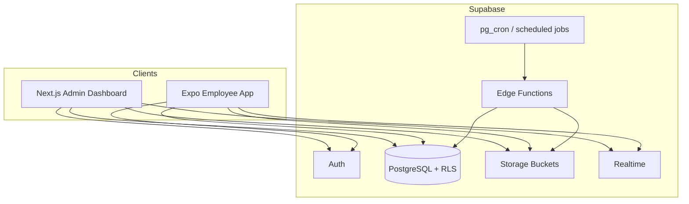
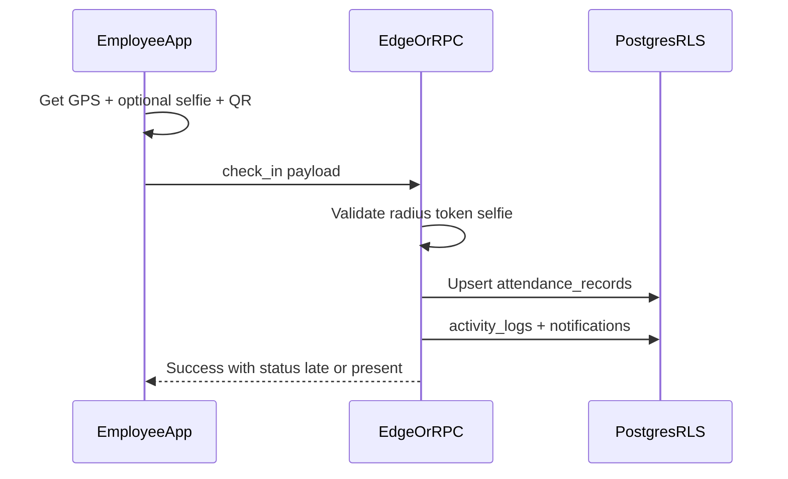

# Media Office — Complete Implementation Plan

**Product:** Smart Employee Attendance Management System  
**Languages:** Kurdish (Sorani) only, RTL  
**Stack:** Next.js (Admin) + Expo (Employee App) + Supabase  
**Scope:** Full product in one pass  
**Tenancy:** Independent company workspaces — no Super Admin  

---

## 1. Goals & Constraints

### Goals
- Production-ready multi-tenant attendance platform
- Complete admin dashboard (desktop + mobile)
- Employee-only mobile app (Expo) — no desktop employee access
- Full isolation between companies
- Smart attendance: GPS, QR, optional selfie
- Leave, reports (PDF/Excel), notifications, activity logs, backup/restore
- Dark/Light mode, modern RTL Kurdish UX

### Hard constraints
| Constraint | Implementation |
|---|---|
| No Super Admin | No platform-level admin role or cross-tenant UI |
| Company isolation | Every row keyed by `company_id`; enforced with Supabase RLS |
| Admins cannot see each other | No company directory; signup creates a private workspace |
| Employees = mobile only | Expo app + API checks `role = employee`; Next.js routes reject employees |
| Kurdish Sorani only | Single locale `ckb`, `dir="rtl"`, no i18n switcher |

### Company onboarding (no Super Admin)
1. Admin self-registers → creates `companies` row + `profiles` (role=`admin`)
2. Admin invites/creates employees (auth users + profiles, role=`employee`)
3. Second independent admin repeats signup → separate company, zero shared data
4. Optional seed script for local/dev: two demo companies (never a super-admin account)

---

## 2. System Architecture



### Responsibilities
| Layer | Responsibility |
|---|---|
| **Next.js** | Admin UI, reports export UI, settings, QR management, backup UI, server actions / route handlers |
| **Expo** | Employee check-in/out, GPS, camera selfie, QR scan, leave, profile, push notifications |
| **Supabase Auth** | Email/password (or phone later); JWT with `company_id` + `role` in claims via custom access token hook or profile join |
| **PostgreSQL + RLS** | Source of truth; tenant isolation |
| **Storage** | Avatars, documents, selfie proofs, backup archives |
| **Edge Functions** | Attendance validation helpers, push notifications, backup export/import, report generation (heavy) |
| **Cron** | Daily absence marking, automatic backups, late-reminder notifications |

### Auth & session model
- `auth.users` linked 1:1 to `public.profiles`
- `profiles.company_id`, `profiles.role` ∈ (`admin`, `employee`)
- JWT custom claims (recommended): `company_id`, `role`, `employee_id`
- Next.js middleware: allow only `role=admin`
- Expo: allow only `role=employee`; block web builds for store release (mobile targets only)

---

## 3. Database Schema

### 3.1 Core tenancy & identity

```sql
-- companies
id              uuid PK DEFAULT gen_random_uuid()
name            text NOT NULL
slug            text UNIQUE  -- internal only, never listed publicly
logo_url        text
timezone        text NOT NULL DEFAULT 'Asia/Baghdad'
work_start_time time NOT NULL DEFAULT '09:00'
work_end_time   time NOT NULL DEFAULT '17:00'
late_grace_minutes int NOT NULL DEFAULT 15
overtime_after_minutes int NOT NULL DEFAULT 0
gps_required    boolean NOT NULL DEFAULT true
qr_required     boolean NOT NULL DEFAULT false
selfie_required boolean NOT NULL DEFAULT false
gps_radius_meters int NOT NULL DEFAULT 150
office_lat      double precision
office_lng      double precision
theme_default   text CHECK (theme_default IN ('light','dark','system')) DEFAULT 'system'
created_at      timestamptz NOT NULL DEFAULT now()
updated_at      timestamptz NOT NULL DEFAULT now()

-- profiles (extends auth.users)
id              uuid PK REFERENCES auth.users(id) ON DELETE CASCADE
company_id      uuid NOT NULL REFERENCES companies(id) ON DELETE CASCADE
role            text NOT NULL CHECK (role IN ('admin','employee'))
full_name       text NOT NULL
phone           text
email           text
avatar_url      text
is_active       boolean NOT NULL DEFAULT true
created_at      timestamptz NOT NULL DEFAULT now()
updated_at      timestamptz NOT NULL DEFAULT now()

-- employees (HR record; 1:1 with profile when role=employee)
id              uuid PK DEFAULT gen_random_uuid()
company_id      uuid NOT NULL REFERENCES companies(id) ON DELETE CASCADE
user_id         uuid UNIQUE REFERENCES profiles(id) ON DELETE SET NULL
employee_code   text NOT NULL
full_name       text NOT NULL
phone           text
email           text
photo_url       text
department_id   uuid REFERENCES departments(id)
position_id     uuid REFERENCES positions(id)
hire_date       date
status          text NOT NULL CHECK (status IN ('active','archived')) DEFAULT 'active'
notes           text
created_at      timestamptz NOT NULL DEFAULT now()
updated_at      timestamptz NOT NULL DEFAULT now()
UNIQUE (company_id, employee_code)
```

### 3.2 Organization structure

```sql
-- departments
id, company_id, name, is_active, created_at, updated_at
UNIQUE (company_id, name)

-- positions
id, company_id, name, is_active, created_at, updated_at
UNIQUE (company_id, name)

-- employee_documents
id, company_id, employee_id, title, file_path, file_type, file_size,
uploaded_by, created_at
```

### 3.3 Attendance

```sql
-- attendance_records
id              uuid PK
company_id      uuid NOT NULL
employee_id     uuid NOT NULL
work_date       date NOT NULL
check_in_at     timestamptz
check_out_at    timestamptz
check_in_lat    double precision
check_in_lng    double precision
check_out_lat   double precision
check_out_lng   double precision
check_in_method text CHECK (method IN ('gps','qr','manual','gps_qr'))
check_out_method text
check_in_selfie_path text
check_out_selfie_path text
check_in_device_info jsonb
check_out_device_info jsonb
check_in_ip     inet
check_out_ip    inet
qr_token_id     uuid REFERENCES qr_tokens(id)
status          text NOT NULL CHECK (status IN (
                  'present','late','early_leave','absent',
                  'on_leave','incomplete','overtime'
                ))
worked_minutes  int NOT NULL DEFAULT 0
late_minutes    int NOT NULL DEFAULT 0
early_leave_minutes int NOT NULL DEFAULT 0
overtime_minutes int NOT NULL DEFAULT 0
notes           text
created_at, updated_at
UNIQUE (company_id, employee_id, work_date)
```

### 3.4 QR & geofence helpers

```sql
-- qr_tokens
id, company_id, label, token_hash, expires_at, is_active,
created_by, created_at
-- rotating QR: admin generates; employees scan payload containing signed token

-- company_locations (optional multi-site later; MVP: use companies.office_*)
id, company_id, name, lat, lng, radius_meters, is_active
```

### 3.5 Leave

```sql
-- leave_types (seeded per company: annual, sick, unpaid — Kurdish labels in app)
id, company_id, code, name_ckb, is_paid, annual_allowance_days, is_active

-- leave_requests
id, company_id, employee_id, leave_type_id,
start_date, end_date, days_count, reason,
status CHECK IN ('pending','approved','rejected','cancelled'),
reviewed_by, reviewed_at, review_note,
created_at, updated_at

-- leave_balances
id, company_id, employee_id, leave_type_id, year,
entitled_days, used_days, remaining_days
UNIQUE (company_id, employee_id, leave_type_id, year)
```

### 3.6 Notifications & activity

```sql
-- notifications
id, company_id, user_id, title, body, type, data jsonb,
is_read, created_at

-- announcements (admin → all employees in company)
id, company_id, title, body, created_by, created_at

-- activity_logs
id, company_id, actor_id, action, entity_type, entity_id,
metadata jsonb, ip, user_agent, created_at
```

### 3.7 Backup

```sql
-- backups
id, company_id, storage_path, size_bytes, status,
triggered_by CHECK IN ('auto','manual'),
created_by, created_at, completed_at, error_message
```

### 3.8 Indexes (essential)
- `(company_id)` on every tenant table
- `attendance_records (company_id, work_date)`
- `attendance_records (company_id, employee_id, work_date)`
- `leave_requests (company_id, status)`
- `notifications (user_id, is_read, created_at DESC)`
- `activity_logs (company_id, created_at DESC)`
- `employees (company_id, status)`, GIN/trigram on `full_name` for search

### 3.9 RLS strategy (isolation)

Helper functions (SECURITY DEFINER, stable):
```sql
auth_company_id() → uuid  -- from JWT claim or profiles lookup
auth_role() → text
is_company_admin() → boolean
```

Policy pattern (every table):
- `SELECT/INSERT/UPDATE/DELETE` WHERE `company_id = auth_company_id()`
- Employees: further restricted to own `employee_id` / `user_id` for attendance, leave, profile, docs (read)
- Admins: full CRUD within company
- **Never** expose `companies` list beyond `id = auth_company_id()`
- Storage policies: path prefix `{company_id}/...`

### 3.10 Computed attendance rules (DB or Edge)
On check-in/out (transactional function `record_check_in` / `record_check_out`):
1. Validate employee active + company settings
2. Validate GPS within radius (if required)
3. Validate QR token (if required)
4. Store selfie path if provided/required
5. Set late/early/overtime vs company work hours
6. Write activity_log + optional notification to admin

---

## 4. Folder Architecture (Monorepo)

```
media-office/
├── IMPLEMENTATION_PLAN.md
├── README.md
├── package.json                 # npm workspaces / pnpm
├── pnpm-workspace.yaml
├── .env.example
├── apps/
│   ├── admin/                   # Next.js 15 App Router
│   │   ├── app/
│   │   │   ├── (auth)/
│   │   │   │   ├── login/
│   │   │   │   └── register/    # creates company + admin
│   │   │   ├── (dashboard)/
│   │   │   │   ├── layout.tsx   # RTL shell, sidebar, theme
│   │   │   │   ├── page.tsx     # Dashboard
│   │   │   │   ├── employees/
│   │   │   │   ├── departments/
│   │   │   │   ├── positions/
│   │   │   │   ├── attendance/
│   │   │   │   ├── leave/
│   │   │   │   ├── reports/
│   │   │   │   ├── notifications/
│   │   │   │   ├── qr/
│   │   │   │   ├── activity-logs/
│   │   │   │   ├── backups/
│   │   │   │   └── settings/
│   │   │   ├── api/             # export PDF/Excel, backup triggers
│   │   │   └── layout.tsx       # dir=rtl, lang=ckb
│   │   ├── components/
│   │   ├── lib/                 # supabase clients, reports, utils
│   │   ├── hooks/
│   │   └── styles/
│   └── mobile/                  # Expo (SDK current stable)
│       ├── app/                 # Expo Router
│       │   ├── (auth)/login.tsx
│       │   ├── (tabs)/
│       │   │   ├── index.tsx        # Home / Check-in
│       │   │   ├── history.tsx
│       │   │   ├── leave.tsx
│       │   │   ├── notifications.tsx
│       │   │   └── profile.tsx
│       │   └── _layout.tsx
│       ├── components/
│       ├── lib/
│       ├── hooks/
│       └── assets/
├── packages/
│   ├── shared/                  # types, constants, validators (zod)
│   ├── supabase/                # generated DB types
│   └── ui/                      # optional shared design tokens
├── supabase/
│   ├── config.toml
│   ├── migrations/
│   ├── functions/
│   │   ├── check-in/
│   │   ├── check-out/
│   │   ├── send-notification/
│   │   ├── create-backup/
│   │   └── restore-backup/
│   └── seed.sql                 # two demo companies (dev only)
└── docs/
    ├── api.md
    ├── rls.md
    └── deployment.md
```

---

## 5. UI/UX Structure

### 5.1 Design system
- **Direction:** RTL, `lang="ckb"`
- **Fonts:** Noto Sans Arabic / Rabar / similar Sorani-capable webfont (admin + Expo)
- **Tokens:** CSS variables — brand primary, surfaces, borders, success/warn/danger
- **Avoid:** purple-gradient cliché, cream+terracotta cliché, newspaper layout
- **Direction:** professional workforce tool — deep teal/slate brand, clear hierarchy, generous spacing
- **Theme:** Light + Dark via `next-themes` / Expo Appearance + persisted preference
- **Components:** buttons, inputs, selects, tables, data cards (admin analytics only), sheets, toasts, empty states
- **Motion:** page fade, sidebar expand, check-in success pulse (2–3 intentional motions)

### 5.2 Admin information architecture

| Route | Purpose |
|---|---|
| `/login`, `/register` | Auth; register = new company workspace |
| `/` | Dashboard KPIs + charts + recent activity |
| `/employees` | List, search, filter by dept/status; add/edit/archive |
| `/employees/[id]` | Profile, photo, documents, attendance summary |
| `/departments`, `/positions` | CRUD |
| `/attendance` | Daily monitor, filters, manual correction (logged) |
| `/leave` | Pending queue + history; approve/reject |
| `/reports` | Daily/weekly/monthly; type tabs; PDF/Excel/Print |
| `/qr` | Generate/rotate QR; print poster |
| `/notifications` | Send announcements; view system alerts |
| `/activity-logs` | Audit trail |
| `/backups` | Manual backup, restore, auto schedule status |
| `/settings` | Work hours, GPS/QR/selfie toggles, office location, company profile |

**Admin shell:** collapsible sidebar (desktop), bottom/drawer nav (mobile), top bar with theme toggle + admin name.

### 5.3 Employee app (Expo) IA

| Screen | Purpose |
|---|---|
| Login | Employee credentials only |
| Home | Big Check-In / Check-Out CTA; today’s status; hours |
| QR Scanner | Camera scan when QR required |
| GPS gate | Request permission; show distance to office |
| Selfie capture | Optional/required per company settings |
| History | Calendar + list; daily/monthly hours |
| Leave | Request form + history + balances |
| Notifications | Inbox |
| Profile | Photo, personal info (read-mostly), logout |

**Mobile-only enforcement:**
- Expo app configured for iOS/Android
- Reject employee JWT on admin Next.js middleware
- Optional: Expo web disabled / shows “ئەپەکە لە مۆبایل بەکاربهێنە”

### 5.4 Key UX flows



Leave approval:
Employee submits → admin notified → admin approves/rejects → employee notified → attendance `on_leave` for date range (cron or trigger).

---

## 6. Feature Spec (Full Pass)

### 6.1 Admin
- [x] Register company + admin
- [x] Employee CRUD + archive + photo + documents
- [x] Departments & positions
- [x] Live/daily attendance + history + filters/search
- [x] Leave approval workflow
- [x] Dashboard KPIs + charts (Recharts)
- [x] Reports: daily/weekly/monthly + absence/late/overtime/employee
- [x] Export PDF (`@react-pdf/renderer` or `jspdf`) + Excel (`exceljs`) + print CSS
- [x] QR token management
- [x] GPS office pin + radius settings
- [x] Selfie requirement toggle
- [x] Notifications + announcements
- [x] Activity logs
- [x] Backup create/restore + daily auto-backup job
- [x] Dark/Light mode
- [x] Fully responsive layout

### 6.2 Employee (Expo)
- [x] Login
- [x] Check-in / Check-out with GPS
- [x] QR scan attendance
- [x] Optional selfie verification
- [x] Device info + IP logging (IP via Edge from request)
- [x] Attendance history + working hours
- [x] Leave request + history
- [x] Notifications (in-app + push via Expo Notifications)
- [x] Profile view
- [x] Dark/Light
- [x] Kurdish RTL UI only

### 6.3 Security & ops
- [x] Supabase Auth + RLS
- [x] Activity logs on sensitive actions
- [x] Storage path isolation
- [x] Rate-limit check-in Edge Function
- [x] Automatic daily company backup (JSON/SQL dump archive to Storage)
- [x] Admin-triggered restore (replace company-scoped data with confirmation)

---

## 7. Technical Decisions (Locked)

| Area | Choice |
|---|---|
| Monorepo | pnpm workspaces |
| Admin | Next.js 15 App Router, TypeScript, Tailwind CSS |
| Mobile | Expo Router, TypeScript, NativeWind or StyleSheet + tokens |
| Backend | Supabase (Auth, Postgres, Storage, Edge Functions, Realtime) |
| Validation | Zod in `packages/shared` |
| Forms | React Hook Form |
| Charts | Recharts (admin) |
| Maps/GPS | `expo-location`; admin map picker (`leaflet` or `maplibre`) |
| QR | `expo-camera` / `expo-barcode-scanner`; admin `qrcode` generator |
| Selfie | `expo-camera` + Storage upload |
| Push | Expo Push + `expo_push_tokens` column on profiles |
| PDF/Excel | Server route handlers in Next.js |
| Backup format | Company-scoped JSON snapshot zip in Storage |
| Hosting | Vercel (admin) + EAS (mobile) + Supabase cloud |

---

## 8. Development Roadmap

Phased delivery inside one full-product pass (no scope cuts — sequencing only).

### Phase 0 — Bootstrap (Day 1–2)
- Create monorepo, apps, packages
- Supabase project + local CLI
- Base migrations: companies, profiles, RLS helpers
- Kurdish RTL shell (admin + mobile)
- Theme system
- Auth: register (company+admin), login, middleware role gates
- Move agent workspace to `media-office/`

### Phase 1 — HR foundation (Day 3–5)
- Departments, positions
- Employees CRUD, archive, photo upload
- Document storage
- Search/filter
- Activity logging middleware/helper
- Seed two isolated demo companies

### Phase 2 — Attendance engine (Day 6–10)
- Company settings: hours, GPS, QR, selfie
- QR token generate/rotate
- RPC/Edge: `check_in`, `check_out`
- Expo: home CTA, GPS, QR, selfie flows
- Admin attendance monitor + history
- Late/early/overtime calculation
- Device + IP logging

### Phase 3 — Leave (Day 11–12)
- Leave types + balances
- Employee request flow
- Admin approve/reject
- Notifications on status change
- Mark attendance on_leave

### Phase 4 — Dashboard, reports, notifications (Day 13–16)
- Dashboard KPIs + charts + recent activity
- All report types + filters
- PDF / Excel / Print
- Announcements + notification center
- Expo notifications tab + push

### Phase 5 — Backup, harden, polish (Day 17–20)
- Manual + automatic backup
- Restore with confirmation
- Advisors/security pass (RLS review)
- Performance indexes, loading/empty/error states
- EAS build profiles + admin production deploy
- End-to-end test checklist (two-company isolation tests)

### Definition of Done
- Two admins can register separately and never see each other’s data (automated SQL/RLS tests)
- Employee cannot open admin routes
- Check-in works with GPS (+ QR/selfie per settings)
- Leave, reports export, backup/restore verified
- Full Kurdish RTL UI on admin + mobile
- Dark/Light works on both clients

---

## 9. Testing Plan

| Type | Focus |
|---|---|
| RLS isolation | Company A admin cannot SELECT company B rows |
| Role gates | Employee JWT rejected by admin middleware |
| Attendance rules | Late/overtime/early math vs timezone |
| Geofence | Outside radius rejected when GPS required |
| QR | Expired/inactive token rejected |
| Leave | Overlap validation; balance decrement on approve |
| Backup/restore | Round-trip company data integrity |
| E2E | Playwright (admin) + Maestro/Detox smoke (mobile) |

---

## 10. Environment Variables

```bash
# Shared
NEXT_PUBLIC_SUPABASE_URL=
NEXT_PUBLIC_SUPABASE_ANON_KEY=
SUPABASE_SERVICE_ROLE_KEY=          # server only
EXPO_PUBLIC_SUPABASE_URL=
EXPO_PUBLIC_SUPABASE_ANON_KEY=

# Admin
NEXT_PUBLIC_APP_URL=

# Mobile
EXPO_PUBLIC_EAS_PROJECT_ID=
```

---

## 11. Risks & Mitigations

| Risk | Mitigation |
|---|---|
| RLS bugs leak data | Mandatory isolation tests; no service-role in client |
| GPS spoofing | Combine GPS + QR + optional selfie; log device; radius checks server-side |
| Backup restore destructive | Double confirm + backup-before-restore |
| Sorani font/rendering | Use proven Arabic-script fonts; test Android/iOS |
| Large reports | Server-side generation; pagination; date-range limits |
| No Super Admin support ops | Document emergency SQL runbooks for infra owner only (outside product UI) |

---

## 12. Immediate Next Steps (after plan approval)

1. Create project via tooling and initialize git monorepo under `media-office/`
2. Scaffold `apps/admin` (Next.js) + `apps/mobile` (Expo) + `packages/shared`
3. Write initial Supabase migrations (schema + RLS)
4. Implement auth register/login + RTL shells
5. Proceed Phase 1 → 5 per roadmap

---

**Awaiting approval to start Phase 0 development.**
